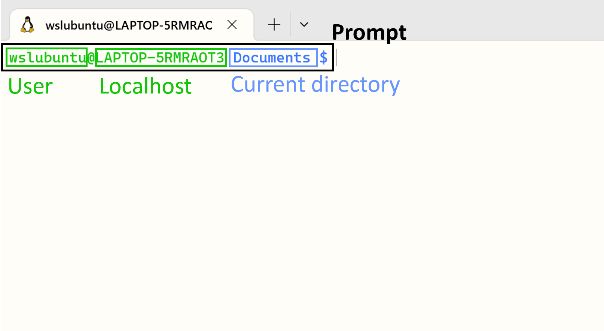

# **An introduction to Bash**

## Matteo Caldana

### Advanced Methods for Scientific Computing (AMSC)

### 15/09/2023


---

## What is a shell?


From [http://www.linfo.org/shell.html](http://www.linfo.org/shell.html):

*"A shell is a program that provides the traditional, text-only user interface for Linux and other Unix-like operating systems. Its primary function is to read commands that are typed into a console [...] and then execute (i.e., run) them. The term shell derives its name from the fact that it is an outer layer of an operating system. A shell is an interface between the user and the internal parts of the OS (at the very core of which is the kernel)."*

---

### What is `Bash`?
`Bash` stands for: `Bourne Again Shell`, a homage to its creator Stephen Bourne. It is the default shell for most Unix systems and Linux distributions. It is both a command interpreter and a scripting language. The shell might be changed by simply typing its name and even the default shell might be changed for all sessions.

macOS has replaced it with [zsh](https://support.apple.com/en-us/HT208050), which is mostly compatible with `Bash`, since v10.15 Catalina.

---

### Variables and Environmental Variables
Since the shell is a program, as in all programs there are variables. You can assign a value to a variable with the equal sign **(no spaces!)**, for instance type `A=1`. You can then retrieve its value using the dollar sign and curly braces, for instance to display it the user may type `echo ${A}`. Some variables can affect the way running processes will behave on a computer, these are called **environmental variables**. For this reason, some variables are set by default, for instance to display the user home directory type `echo ${HOME}`. To set an environmental variable just prepend `export`, for instance `export PATH="/usr/sbin:$PATH"` adds the folder `/usr/sbin` to the `PATH` environment variable. `PATH` specifies a set of directories where executable programs are located.

---

### Types of shell - Login
The first distinction that we make is between:
*  A **login** shell logs you into the system as a specific user (it requires username and password). When you hit `Ctrl+Alt+F1` to login into a virtual terminal you get after successful login: a login shell (that is interactive).
* A **non-login** shell is executed without logging in (it requires a current logged in user). When you open a graphic terminal it is a non-login (interactive) shell. 

---

### Types of shell - Interactive
The second distinction we make is between:
* In an **interactive** shell (login or non-login) you can interactively type or interrupt commands. For example a graphic terminal (non-login) or a virtual terminal (login). In an interactive shell the prompt variable must be set (`$PS1`).
* A **non-interactive** (sub)shell is usually run from an automated process. Input and output are not exposed (unless explicitly handled by the calling process). This is normally a non-login shell, because the calling user has logged in already. A shell running a script is always a non-interactive shell (but the script can emulate an interactive shell by prompting the user to input values).

---

## Exploring the Terminal

The **prompt** can be customized (more on that later).

---

## Moving quickly in the Terminal (1/2)
It should almost never happen that you have to write a terminal command by typing it out character by character. Instead, you should rely on shortcuts to be more efficient. Here some tips:

- `Tab`: Auto-completes commands and paths. E.g. if in the current folder there are the files `main.cpp` and `test.cpp`, if you type `g++ m` and press `Tab`, it will auto-complete to `g++ main.cpp`.
- `Up` and `Down` arrows: Slide through previous commands.
- `Ctrl + R`: Start a incremental reverse search of your bash history. In other words it finds the last complete command that you executed that starts with what you are typing.
- `Ctrl + L`: Similar to `clear` command, clears the terminal screen


---

## Moving quickly in the Terminal (2/2) <span style="color:red;float:right">(Advanced)</span>


---

### `Bash` as a command line interpreter
When launching a terminal a Unix system first launches the shell interpreter specified in the `SHELL` **environment variable**. If `SHELL` is unset it uses the system default.

After having sourced the initialization files, the interpreter shows the **prompt** (defined by the environment variable `$PS1`).

Initialization files are hidden files stored in the user's home directory, executed as soon as an **interactive** shell is run. 

---
### Initialization files

- **login**:
        - `/etc/profile`, `/etc/profile.d/*`, `~/.profile` for Bourne-compatible shells
            - `~/.bash_profile` (or `~/.bash_login`) for `Bash`
            - `/etc/zprofile`, `~/.zprofile` for `zsh`
            - `/etc/csh.login`, `~/.login` for `csh`

- **non-login**: `/etc/bash.bashrc`, `~/.bashrc` for `Bash`

- **interactive**:
            - `/etc/profile`, `/etc/profile.d/*` and `~/.profile`
            - `/etc/bash.bashrc`, `~/.bashrc` for `Bash`

- **non-interactive**:
            - `/etc/bash.bashrc` for `Bash` (but most of the times the script begins with: `[ -z "$PS1" ] && return`, *i.e.* don't do anything if it's a non-interactive shell).
            - depending on the shell, the file specified in `$ENV` (or `$BASH_ENV`)  might be read.

---

### Getting started
To get a little hang of the bash, let’s try a few simple commands:
- `echo`: returns whatever you type at the shell prompt similar to `print` in Python, or `disp` in Matlab.
- `date`: displays the current time and date.
- `clear`: clean the terminal.

---

### Basic Bash Commands 1/2
- `pwd` stands for **Print working directory** and it points to the current working directory, that is, the directory that the shell is currently looking at. It’s also the default place where the shell commands will look for data files.
- `ls` stands for a **List** and it lists the contents of a directory. ls usually starts out looking at our home directory. This means if we print ls by itself, it will always print the contents of the current directory.
- `cd` stands for **Change directory** and changes the active directory to the path specified.

---

### Basic Bash Commands 2/2

- `mkdir` stands for **Make directory** and is used to make a new directory or a folder.
- `mv` stands for **Move** and it moves one or more files or directories from one place to another. We need to specify what we want to move, i.e., the source and where we want to move them, i.e., the destination.
- `touch` command is used to create new, empty files. It is also used to change the timestamps on existing files and directories.
- `rm` stands for **Remove** and it removes files or directories. By default, it does not remove directories, but if used as `rm -r *` within a directory, then every directory and file inside that directory is deleted (`*` is a special characters that matches everything).
- `env` list the environmental variables

---

### Not all commands are equals
When executing a command, like `ls` a subprocess is created. A subprocess inherits all the environment variables from the parent process, executes the command and returns the control to the calling process.

**A subprocess cannot change the state of the calling process.**

The command `source script_file` executes the commands contained in `script_file` as if they were typed directly on the terminal. It is only used on scripts that have to change some environmental variables or define aliases or function.
Typing `. script_file` does the same.

If the environment should not be altered, use `./script_file`, instead. 

---

### Run a script
To run your brand new script you may need to change the access permissions of the file. To make a file executable run

```bash
chmod +x script_file
```

Finally, remember that the **first line of the script** tells the shell which interpreter to use while executing the file. So, for example, if your script starts with `#!/bin/bash` it will be run by `Bash`, if is starts with `#!/usr/bin/env python` it will be run by python.

---

### Built-in commands
Some commands, like `cd` are executed directly by the shell, without creating a subprocess.

Indeed it would be impossible the have `cd` as a regular command! Why?

**Answer**: a subprocess cannot change the state of the calling process, whereas `cd` needs to change the value of the environmental variable `PWD`(that contains the name of the current working directory).

---

### Other commands
In general a **command** can refer to:
  - a builtin command;
  - an executable;
  - a function.

The shell looks for executables with a given name within directories specified in the environment variable `PATH`, whereas aliases and functions are usually sourced by the `.bashrc` file (or equivalent).

To check what `command_name` is:
```bash
type command_name
```

To check its location type:
```bash
which command_name
```

---

### A warning about filenames
In order to live happily and without worries, **don't** use spaces nor accented characters in filenames!

Space characters in file names should be forbidden by law! The space is used as separation character, having it in a file name makes things a lot more complicated in any script (not just `bash` scripts).

Use underscores (snake case): `my_wonderful_file_name`, or uppercase characters (camel case): `myWonderfulFileName`, or hyphens: `my-wonderful-file-name`, or a mixture:
`myWonderful_file-name`, instead.

But **not** `my wonderful file name`. It is not wonderful at all if it has to be parsed in a script.

---

### Quotes
Double quotes may be used to identify a string where the variables are interpreted. Single quotes identify a string where variables are not interpreted. Check the output of the following commands
```bash
a=yes
echo "$a"
echo '$a'
```
The output of a command can be converted into a string and assigned to a variable for later reuse:
```list=`ls -l` ``` 
or
```list=$(ls -l)```

---

### Wildcards
A wildcard is a character (or set of characters) that in a command matches one or more characters. It is really useful for searching a file (maybe you know just its extension) or applying a command to a subset of files (maybe you want to copy only files starting with `2023-`).

- The wildcard `?` matches a single character. E.g., `S??n` will match anything that begins with S and end with n and has exactly two characters between them. It matches `Soon` and `Sean` but not `Sin`. 
- The wildcard `*` matches any number of characters or a set of characters. E.g., `S*n` will match anything between S and n. The number of characters between them does not count. It matches `Soon`, `Sean` and `Sin`.
- The wildcard `[]` matches characters that are enclosed in the square braces. E.g., `S[on]n` matches only `Son` and `Snn`. We can also specify range of characters with the `-` character. E.g., braces like `S[a-d]n` match `San`, `Sbn`, `Scn`, `Sdn`.

---

### <span style="color:blue;">Exercises</span>
- Go to your home folder (*Suggestion:* you can either use `~` or `$HOME`)
- Create a folder named `test1`
- Go inside `test1` and create a directory `test2`
- Go inside `test2` and then up one directory (*Suggestion:* `..` indicates the upper directory)
- Create the following files `f1.txt`, `f2.txt`, `f3.dat`, `f4.md`, `readme.md`, `.hidden`
- List all files in the directory, also the hidden ones
- List only files with txt extension (*Suggestion:* use `*` wildcard)
- List files with `1`, `2`, `3` or `4` in the name (*Suggestion:* use `[1-4]` wildcard)
- Move the `readme.md` in `test2`
- Move all txt files in `test2` in one command
- Remove `f3.dat`
- Remove all contents of `test2` and the folder itself in one commands

---

### Download and extract a Matrix
With `wget` you can retrieve content from web servers. For instance, you can download a matrix from the matrix market with `wget https://math.nist.gov/pub/MatrixMarket2/NEP/mhd/mhd416a.mtx.gz`.
To unzip the file, simply type `gzip -dk mhd416a.mtx.gz`

---

### More commands
- `cat` stands for **Concatenate** and it reads a file and outputs its content. It can read any number of files, and hence the name concatenate.
- `wc` is short for **Word count**. It reads a list of files and generates one or more of the following statistics: newline count, word count, and byte count.
- `grep` stands for **Global regular expression print**. It searches for lines with a given string or looks for a pattern in a given input stream.
- `head` show the first lines of a file
- `tail` show the last lines of a file 
- `file` reads the files specified and performs a series of tests in attempt to classify them by type

---

### Redirection, Pipelines and Filters
We can add operators between commands in order to chain them together.
- The pipe operator `|`, forwards the output of one command to another. E.g. `cat /etc/passwd | grep user` checks system information about "user".
- The redirect operator `>` sends the standard output of one command to a file. E.g. `ls > files-in-this-folder.txt` saves a file with the list of files.
- The append operator `>>` appends the output of one command to a file.
- The operator `&>` sends the standard output and the standard error to file
- `&&`  pipe is activated only if the return status of the first command is 0. It is used to chain commands together: e.g. `sudo apt update && sudo apt upgrade`
- `||` pipe is activated only if the return status of first command is different from 0.
- `;` is a way to execute to commands regardless of the output status
- `$?` is a variable containing the output status of the last command

---

### <span style="color:blue;">Exercises</span>
- Create a file with the current date (one command) and display its content
- Count the number of lines in the matrix `mhd416a.mtx` (*Suggestion:* use `cat`, `wc` and `|`)
- List the entries of the matrix that are smaller than 1e-10 in absolute value. You can assume that all values are in exponential format and all values are greater than 1e-100 in absolute value. Count how many entries satisfy this criteria. (*Suggestion:* use `cat`, `grep`, `wc` and `|` )

---

### Regex <span style="color:red;float:right">(Advanced)</span>

Similarly to wildcards, regular expressions (regex or regexp) are a string that matches a family of strings. They are extremely useful in extracting information from any text by searching for one or more matches of a specific search pattern. They are supported in almost all programming languages and by `grep`.

In this site you can test and debug your regex interactively:
https://regex101.com/

In this site you can find step-by-step interactive exercises:
https://regexone.com/

---

### Regex - Anchors <span style="color:red;float:right">(Advanced)</span>
- `^`: matches the start of the line
- `$`: matches the end of the line

##### Examples:

```bash
echo "the the end end" | grep --color -P ^the
echo "the the end end" | grep --color -P the
echo "the the end end" | grep --color -P end
echo "the the end end" | grep --color -P end$
```

###### Notes:
`--color` option is tho color the grep match
`-P` option is for regex
`-i` option is for case insensitive

---

### Regex - Quantifiers <span style="color:red;float:right">(Advanced)</span>
- `(...)`: characters in brackets define a **group**, meaning they are treated as a single entity by quantifiers
- `*`: matches **zero or more** times the group before this character
- `+`: matches **one or more** times the group before this character
- `?`: matches **zero or one** times the group before this character
- `{2}`: matches **exactly** two times the group before this character
- `{2,}`: matches two or more times the group before this character
- `{2,5}`: matches two to five times the group before this character

##### Examples:
```bash
echo abcbcbc | grep --color -P "a(bc)?"
echo abcbcbc | grep --color -P "a(bc){2}"
echo abcbcbc | grep --color -P "a(bc)*"
```

---

### Regex - OR operator <span style="color:red;float:right">(Advanced)</span> 
- `|`: matches the group on the right or on the left
- `[...]`: matches any of the characters in the square brackets
- `[^...]`: `^` inside square brackets has a different meaning, it is a negation: means any character but the ones in the square brackets 

##### Examples:
```bash
echo abcbcbc | grep --color -P "[ab]"
echo abcbcbc | grep --color -P "(a|b)"
echo abcbcbc | grep --color -P "abc[^d]c"
```

---
### Regex - Character classes <span style="color:red;float:right">(Advanced)</span>
- `\d`: matches a single character that is a digit (equivalent to `[0-9]`)
- `\w`: matches a word character (alphanumeric and underscore, `[a-zA-Z0-9_]`)
- `\s`: matches a whitespace character (includes tabs and line breaks)
- `.`: matches any character

##### Examples:
```bash
echo abcbcbc-1234 | grep --color -P "\w"
```

##### Note:
What if I want to match `.`? Use the escape `\`
```bash
echo "ab.d-abcd" | grep --color -P "ab[^\.]d"
```

---
### Regex - Greedy vs lazy <span style="color:red;float:right">(Advanced)</span>
The quantifiers `* + {}` are greedy operators, so they expand the match as far as they can through the provided text.

For example, `<.+>` matches `<div>simple div</div>` in `This is a <div> simple div</div> test`. In order to catch only the div tag we can use a `?` to make it lazy:

```bash
echo "This is a <div> simple div</div> test" | grep --color -P "<.+>"
echo "This is a <div> simple div</div> test" | grep --color -P "<.+?>"
```
---
### Regex - Look ahead <span style="color:red;float:right">(Advanced)</span>

- `d(?=r)`       matches a d only if is followed by r, but r will not be part of the overall regex match
- `(?<=r)d`      matches a d only if is preceded by an r, but r will not be part of the overall regex match
- `d(?!r)`       matches a d only if is not followed by r, but r will not be part of the overall regex match 
- `(?<!r)d`      matches a d only if is not preceded by an r, but r will not be part of the overall regex match

---

### Advanced commands - `tr` <span style="color:red;float:right">(Advanced)</span>
 - `tr` stands for **translate**. It supports a range of transformations including uppercase to lowercase, squeezing repeating characters, deleting specific characters, and basic find and replace. For instance:
     - `echo "Welcome to apsc labs" | tr [a-z] [A-Z]` converts all characters to upper case.  
     - `echo -e "A;B;c\n1,2;1,4;1,8" | tr "," "." | tr ";" ","` translates a line of a CSV in italian format to a standard format.
     - `echo "my ID is 73535" | tr -d [:digit:]` deletes all the digits from the string

---

### Advanced commands - `sed` <span style="color:red;float:right">(Advanced)</span>
 - `sed` stands for **stream editor** and it can perform lots of functions on file like searching, find and replace, insertion or deletion. We give just an hint of its true power
    - `echo "unix is great os. unix is open source." | sed 's/unix/linux/'` replaces the first occurrence of "unix" with "linux"
    - `echo "unix is great os. unix is open source." | sed 's/unix/linux/2'` replaces the second occurrence of "unix" with "linux"
    - `echo "unix is great os. unix is open source." | sed 's/unix/linux/g'` replaces all occurrences of "unix" with "linux"
    - `echo -e "ABC\nabc" | sed '/abc/d'` delete a line matching "abc"
    - `echo -e "1\n2\n3\n4\n5\n6\n7\n8" | sed '3,6d'` delete lines 3 to 6


---

### Advanced commands - `cut` and `find` <span style="color:red;float:right">(Advanced)</span>
 - `cut` is a command for cutting out the sections from each line of files and writing the result to standard output.
     - `cut -b 1-3,7- state.txt` cut bytes (`-b`) from 1 to 3 and from 7 to end of the line
     - `echo -e "A,B,C\n1.22,1.2,3\n5,6,7\n9.99999,0,0" | cut -d "," -f 1` get the first column of a CSV (`-d` specifies the delimiter among field, `-f n` specifies to pick the n-th field from each line)
 - `find` is used to find files in specified directories that meet certain conditions. For example: `find . -type d -name "*lib*"` find all directories (not files) starting from the current one (`.`) whose name contain lib.
 - `locate` is less powerful than `find` but much faster since it relies on a database that is updated on a daily base or manually using the command `updatedb`. For example: `locate -i foo` finds all files or directories whose name contains `foo` ignoring case.

---

### Processes <span style="color:red;float:right">(Advanced)</span>
- Launch a command and send it in the background: `./my_command &`

- `Ctrl-Z` suspends the current subprocess and `bg` reactivates the suspended subprocess in the background.

- `jobs` lists all subprocesses running in the background in the terminal.

- `fg %n` brings back to the foreground the n-th subprocess in the background.

- `Ctrl-C` terminates the subprocess in the foreground (when not trapped).

- `kill pid` sends termination signal to the subprocess with id `pid`. You can get a list of the most computationally expensive processes with `top` and a complete list with `ps aux` (usually `ps aux` is filtered through a pipe with `grep`)

All subprocesses in the background of the terminal are terminated when the terminal is closed (unless launched with `nohup`, but that is another story...)

---

### How to get help
Most commands provide a `-h` or `--help` flag to print a short help information: 
```bash
find -h
```

`man command` prints the documentation manual for command.
There is also an info facility that sometimes provides more information: `info command`.


