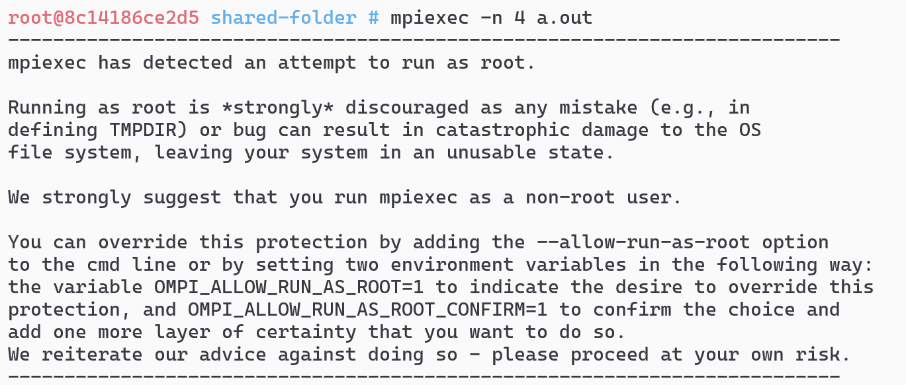

# 1. The MPI `root` problem
When you try to execute a program in parallel in MPI inside the Docker container you will probably encounter an error like the following:



This is due to the fact that MPI does not want to run as `root` since it has too many privileges.
To solve it we create a user **inside the container** with the two following commands

```bash
/usr/sbin/groupadd -r jellyfish && /usr/sbin/useradd -r -g jellyfish jellyfish
chown jellyfish /home/jellyfish && chgrp jellyfish /home/jellyfish && chown jellyfish /root
```

Now exit the container, and, from now on, **every time** you enter the container you should use this command, that makes you enter as the `jellyfish` user

```bash
docker exec -u jellyfish -w /home/jellyfish -it hpc-env /bin/bash
```

### 1.2 A sub-optimal solution
Another way to solve this problem, that we advise against, is to set the two following environmental variables every time you enter the Docker container
```bash
export OMPI_ALLOW_RUN_AS_ROOT=1
export OMPI_ALLOW_RUN_AS_ROOT_CONFIRM=1
```


# 2. The `Read -1` error

When running MPI on Docker, you may experience errors like the following:
```
Read -1, expected <some_number>, errno = 1 error
```
This is a known issue (see, e.g., [here](https://github.com/open-mpi/ompi/issues/4948)), that can be solved by typing the following command on the terminal:
```bash
export OMPI_MCA_btl_vader_single_copy_mechanism=none
```
You may add this command to your `.bashrc` file, too!
```bash
printf  "\nexport OMPI_MCA_btl_vader_single_copy_mechanism=none\n" >> ~/.bashrc
```