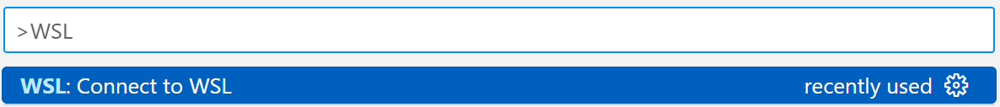
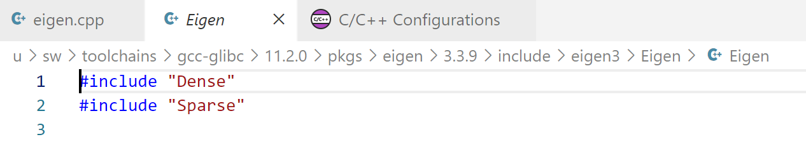

# Environment setup
For the laboratories of the courses of
- ADVANCED METHODS FOR SCIENTIFIC COMPUTING
- NUMERICAL LINEAR ALGEBRA
- NUMERICAL METHODS FOR PARTIAL DIFFERENTIAL EQUATIONS

you will need two things:

1. a text editor (we warmly suggest [Visual Studio Code](https://code.visualstudio.com/), which is available for Linux, Windows and MacOS)
2. the mk modules

## 1. What are mk modules?

[mk modules](https://github.com/pcafrica/mk) bundle a set of scientific libraries compiled under the same toolchain. Once installed, they provide the command module, that has several subcommands:

```
module load <module name> 
```

loads the requested module. This creates a set of environment variables storing relevant paths for that library (e.g. `mkEigenPrefix`, `mkEigenInc`, ...). Use

- `env | grep mk`  to obtain a list of all the environment variables relative to mk modules
- `module list`: to show a list of currently loaded modules
- `module avail`: to show a list of all available modules (loaded or not)
- `module --help`: to show a list of all the commands

## 2. Installation
The mk modules are natively available **only for (reasonably modern) Linux distributions**. However, do not worry if you do not have a machine with Linux, here you find a flowchart of how you can obtain the mk modules (and a Linux distribution) depending on your OS:


### 2.1. Docker

#### 2.1.1 How it works
The two most important terms when it comes to `Docker` are **image** and **container**. 
- Images are blueprints of VMs and define the environment as a frozen snapshot in time. 
- Containers are instances of images.

We provide you the image with everything that you need (a Linux OS (Ubuntu) with the mk modules installed), so what you need to do is just to build a container. This container will then serve as our development environment: we can launch our shell in it, mount local folders to it, etc. We usually call the machine on which Docker is installed (the one with MacOS) the **host** and the operating system running *inside* the container the **guest**.

#### 2.1.2 Download Docker Desktop

As a first step, install the [Docker container environment](https://www.docker.com/). You can follow the instruction on the [official guide](https://docs.docker.com/get-docker/). **Please read it thoroughly**.

`Docker` is relatively heavy on RAM, and it might help to go to `Settings` and enabling the *Virtualization framework* under *Experimental features*.

#### 2.1.3 Pull the Docker image
From a terminal with admin privileges, run the command

```bash
docker pull pcafrica/mk
```

The image is just a snapshot of the state of a Ubuntu distro, it is like a saving point from where you want to start. You can check your images with `docker image ls`.

#### 2.1.4 Use the Docker image 
To use your image you need to create a Docker container. To make a parallel with virtual machines, the Docker image is like the `.iso` of the OS, but then you have to install it. We want to create a container with the image we have just downloaded, give it a name (`--name hpc-env`) to remember its function and share a folder with the host so that we can exchange file easily (`-v /path/to/host/folder:/home/jellyfish/shared-folder`). The complete command is:

```bash
docker run --name hpc-env -v /path/to/host/folder:/home/jellyfish/shared-folder -it -d pcafrica/mk
```

**WARNING:** you have to substitute `/path/to/host/folder` with the actual name of the path on your laptop, for instance `/home/matteo/polimi/amsc23-24/shared-folder`

**WARNING:** to avoid problems `/path/to/host/folder` should not contain white spaces or special characters. 

**WARNING:** use global path starting with `/`, avoid using `~`

You have now created a container. To turn on the container type:

```bash
docker start hpc-env
```
To enter into the container run:

```bash
docker exec -it hpc-env /bin/bash
```
You can leave the container and return to your OS with `exit`. You can check your containers and their status with the command

```bash
docker ps -a
```
If the status of the container is `UP`, you can stop it with

```bash
docker stop hpc-env
```
Once you have created your container remember to **do not** use again the command `run` but just `start`. Otherwise you will create every time a new container. If you want to remove a container you created for mistake you can run:

```bash
docker rm <name-of-the-container>
```

Always remember that documentation is your best friend! Do not panic, just type:
```bash
docker --help
```

#### 2.1.5 Day to day
This section provides a quick reminder of the workflow if you have already gone through all the steps above.

Write code in your favorite editor and **store the files in the shared folder**.

Launch `Docker Desktop` and open a terminal. Check your container status with

```bash
docker ps -a
```

If the container is not already running, start it with

```bash
docker start hpc-env
```

Log into a shell of the container just started with

```bash
docker exec -it hpc-env /bin/bash
```

and locate the shared folder (mounted under `~/shared-folder/`). Anything you add to this folder will be visible from both the host and the container, under the respective mount points. Then, you can compile code and run command-line tools and executables from the container shell, *e.g.* with

```bash
g++ main.cpp -o main
./main
```

When you are done working, exit and stop the container with

```bash
exit
docker stop hpc-env
```

Now you can exit `Docker Desktop`.


### 2.2 WSL
First of all, on Windows we suggest to use [Windows Terminal](https://apps.microsoft.com/store/detail/windows-terminal/9N0DX20HK701) as your preferred terminal.

Windows Subsystem for Linux (WSL) is a feature of Windows that allows developers to run a Linux environment without the need for a separate virtual machine or dual booting. 

To install it follow the [official guide](https://learn.microsoft.com/en-us/windows/wsl/install). Make sure to install WSL 2 (you can find the details in the guide). As Linux distro we suggest Ubuntu.

Here you can find a [summary of the WSL commands](https://learn.microsoft.com/en-us/windows/wsl/basic-commands).

If the installation is successful the Linux distro profile should appear among your Windows Terminal profiles.

From the WSL terminal you can access to you folders by changing your working directory to `/mnt/c`. For instance if you want to access to the directory `C:\Users\Matteo\Documents\Polimi\AMSC23-24\AMSC-Labs` in your WSL terminal you can execute `cd /mnt/c/Users/Matteo/Documents/Polimi/AMSC23-24/AMSC-Labs`.

### 2.3 Dual Boot
Dual-booting is the act of installing two operating systems on a single computer, and being able to choose which one to boot. You will need to install a Linux distribution, we suggest Ubuntu 20.04 LTS or 22.04 LTS. 

Before proceeding we suggest you to backup you data. To install a Dual Boot you can follow the [official guide](https://help.ubuntu.com/community/WindowsDualBoot) (which is a bit dated) or this [unofficial tutorial](https://itsfoss.com/install-ubuntu-1404-dual-boot-mode-windows-8-81-uefi/).

After you're done, you can proceed to Section 2.3.

### 2.4 Download and install the modules

1. Download `mk-2022.0-full.tar.gz` from [this link](https://github.com/pcafrica/mk/releases/download/v2022.0/mk-2022.0-full.tar.gz). E.g.
```bash
wget https://github.com/pcafrica/mk/releases/download/v2022.0/mk-2022.0-full.tar.gz
```
2. `sudo tar xvzf mk-2022.0-full.tar.gz -C /` (~ 4.5GB required).

To load them you should type each time you open the terminal `source /u/sw/etc/bash.bashrc`. However you can add the following lines to the `${HOME}/.bashrc` file (or equivalent) to have them always loaded:
```bash
# mk.
source /u/sw/etc/bash.bashrc
module load gcc-glibc/11.2.0
module load eigen tbb
```

Complete user guide available [here](https://lmod.readthedocs.io/en/latest/010_user.html).

## 3. Test the installation

1. Using VS Code, open a folder (if you work on MacOs this must be the shared folder) and create a file `test-installation.cpp` with content:

```cpp
#include <Eigen/Eigen>
#include <iostream>

int main(int argc, char** argv)
{
        std::cout << "Successfully included Eigen." << std::endl;
        return 0;
}
```

2. Open the terminal (on MacOS you must enter in the container, see Section 2.1.5; on Windows it must be the WSL terminal). Check that `Eigen` is loaded with `module list`, if an error appears load the toolchain with `source /u/sw/etc/profile` and then the Eigen module with `module load gcc-glibc eigen`.

3. From inside the terminal move to the folder containing the file `test-installation.cpp` (if you are using Docker go to `/home/jellyfish/shared-folder`, if you are using WSL remember that folder under `C:\` are found under `/mnt/c`). Here some useful commands:
  * `cd` to change directory, E.g. `cd shared-folder`
  * `ls` to list the content of the current working directory
  * `pwd` to show the current working directory

4. Compile and run the test. Once in the correct folder execute the two following commands:
```bash
g++ -I ${mkEigenInc} test-installation.cpp -o test-installation
./test-installation
```


## 4. Set up Visual Studio Code
As you may have noticed, VS Code linter raises an error like the following when including Eigen. 


This is caused by the fact that the Eigen library (contained in the mk modules) is in a place (path) where usually the compiler never looks. Since we will always compile from command line, and manually specify where the compiler should look for the libraries (with the `-I` option) this is not an issue, and this section is completely optional. However, if you want to fix this problem keep on reading.

### 4.1 Requirements
If you are not on Linux you need first to download a VS Code extension to have complete integration with WSL/Docker. You can search for extensions by clicking of the left of your screen.
**After these steps it might be needed to re-install the "C\C++" extension inside the VS Code instance that is connected to WSL/Docker.**


#### 4.1.1 WSL
For WSL you need the "WSL" extension


After installing it, to use it press `F1`, it should open a bar on top where you should find the command (by typing it) "Connect to WSL".



It should open a new instance of VS Code connected to the WSL (the first time it may take a while). 
Here you can open and work in any folder of the WSL.

#### 4.1.2 Docker
For Docker you need the "Dev Containers" extension


After installing it, to use it press `F1`, it should open a bar on top where you should find the command (by typing it) "Attach to a running container" (before using it you have to `docker start hpc-env`).


It should open a new instance of VS Code connected to the Docker (the first time it may take a while). 
Here you can open and work in any folder of the Docker container.

### 4.2 Modify the `includePath`
The last step is to update where to look for the files that we are including.
First open the folder where you want to work.
**Beware that this configuration change will affect only this folder**
Click on the lightbulb (you may need to click on that line to make it appear) and than on `Edit "includePath" settings`.


Put `/u/sw/toolchains/gcc-glibc/11.2.0/prefix/bin/g++` as "Compiler path".


Add
```
/u/sw/toolchains/gcc-glibc/11.2.0/base/include
/u/sw/toolchains/gcc-glibc/11.2.0/pkgs/eigen/3.3.9/include/eigen3
/u/sw/toolchains/gcc-glibc/11.2.0/pkgs/lis/2.0.30/include
/u/sw/toolchains/gcc-glibc/11.2.0/pkgs/dealii/9.3.1/include
```
to the "Include path".
Set "C++ standard" to "c++20".


Now, going back to our file, the include path should be clickable (while pressing `Ctrl`)





