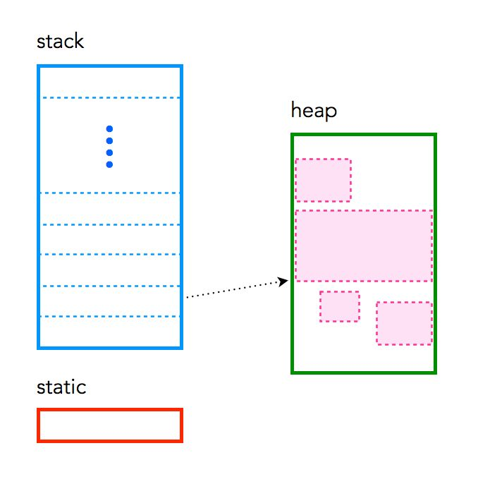
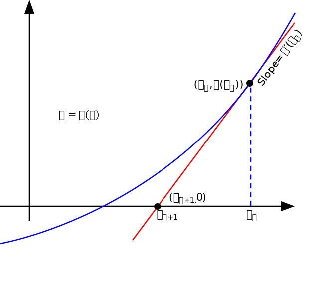

# 1. Memory in C++ – the stack, the heap, and static

C++ has three different pools of memory.
- **static**: global variable storage, permanent for the entire run of the program.
- **stack**: local variable storage (automatic, continuous memory).
- **heap**: dynamic storage (large pool of memory, not allocated in contiguous order).



## Static memory
Static memory persists throughout the entire life of the program, and is usually used to store things like global variables, or variables created with the `static` clause. Their address is fixed and cannot be changed.

## Stack memory
The stack is used to store variables used on the inside of a function (including the `main()`` function). It’s a LIFO, “Last-In,-First-Out”, structure. Every time a function declares a new variable it is “pushed” onto the stack. Then when a function finishes running, all the variables associated with that function on the stack are deleted, and the memory they use is freed up. This leads to the “local” scope of function variables. The stack is a special region of memory, and automatically managed by the CPU – so you don’t have to allocate or deallocate memory. Stack memory is divided into successive frames where each time a function is called, it allocates itself a fresh stack frame.


Note that there is generally a limit on the size of the stack – which can vary with the operating system. If a program tries to put too much information on the stack, **stack overflow** will occur. Stack overflow happens when all the memory in the stack has been allocated, and further allocations begin overflowing into other sections of memory. Stack overflow also occurs in situations where recursion is incorrectly used or is too deep.

## Heap memory
The heap is the diametrical opposite of the stack. The heap is a large pool of memory that can be used dynamically – it is also known as the “free store”. This is memory that is not automatically managed – you have to explicitly allocate (`new`), and deallocate (`free`) the memory. Failure to free the memory when you are finished with it will result in what is known as a memory leak – memory that is still “being used”, and not available to other processes. This is why you **SHOULD ALWAYS PREFER** using the `std` library to automatically manage memory, that is use managed data structures `std::vector`, `std::map`, `std::set`...  and smart pointers `std::shared_ptr`, `std::unique_ptr`. Unlike the stack, there are generally no restrictions on the size of the heap (or the variables it creates), other than the physical size of memory in the machine. Variables created on the heap are accessible anywhere in the program.

## An example of memory use
see [memory.cpp](01-memory/memory.cpp) and comments thereinafter

**Extra**: use [doxygen](https://www.doxygen.nl/index.html) comments

### Remarks

The variable `count` is static storage, because of its keyword `static`. Its function is to count how many instances of the class `Counter` have been created. Both `y` and `a` are dynamic stack storage which is deallocated when the program ends. Indeed, notice that arrays which size is known at compile time are allocated on the stack. Behind the hood, the function `new` is used to allocate the memory for `std::vector` and `std::shared_ptr`, the `delete` is handled by the destructor of these classes.


# 2. Polymorphism 
## 2a - Dynamic Polymorphism through Public Inheritance
See [shapes](02-shapes/inheritance-full/) full example for the solution

## Assignments
1. Implement an abstract class `Shape`, that has a name and a pure virtual function `getArea` to compute its area
2. Implement the concrete children `Circle` and `Rectangle` that receive as constructor parameters the values needed to compute the area (e.g. radius, basis, height...) and override the pure virtual `getArea`.
3. Instantiate a vector of `Shape`s using `shared_ptr` and print the area of each shape

## Comments
The huge advantage of this design pattern is that we can iterate seamlessly through the vector, without knowing which is the actual shape. Indeed, thanks to polymorphism, each shape behaves exactly as it should by resolving the correct method to call at run-time. 

However, this comes with two drawbacks:
1. The run-time cost of resolving the [virtual table](https://en.wikipedia.org/wiki/Virtual_method_table). That is, the cost of checking which kind of `Shape` an element of the vector is and, by using a table (map), finding the pointer to the correct method.
2. Low spatial [locality](https://en.wikipedia.org/wiki/Locality_of_reference) of memory. That is, each element of the vector is allocated independetly from the others on the heap, this means that elements that are close in the vector may be have large difference in memory addresses (they are physically distant in the RAM). This hurt performances because CPUs like to access memory that is physically in sequence.

## 2b - Comparison with function templates and concepts
We can implement polymorphism in more ways, each offering different capabilities and trade-offs across different programming scenarios.
Here we consider runtime (dynamic) polymorphism via public inheritance ([inheritance.cpp](02-shapes/simplified-comparison/01_inheritance.cpp)) and compile-time polymorphism via templates ([function-templates.cpp](02-shapes/simplified-comparison/02_function-templates.cpp)),  together with its improvements made available by concepts in the C++20 standard ([concepts.cpp](02-shapes/simplified-comparison/03_concepts.cpp))

| Polymorphism Type | Mechanism | Key Characteristics | Advantages | Disadvantages |
|-------------------|-----------|---------------------|------------|---------------|
| <b>Dynamic Polymorphism</b><br>(Public Inheritance) | Virtual functions and polymorphic base classes | - Runtime resolution<br>- Use of pointers/references<br>- Virtual table overhead | - Maximum flexibility<br>- Supports downcasting<br>- Runtime extensibility | - Performance overhead<br>- More complex compilation<br>- Additional memory consumption |
| <b>Template Polymorphism</b> | Generic programming | - Compile-time resolution<br>- Automatic type deduction<br>- Type-specialised code | - Optimal performance<br>- Static typing<br>- No runtime overhead | - More verbose code<br>- Potential binary bloat<br>- Complex compilation errors |
| <b>Concepts Polymorphism</b> | Template constraints | - Compile-time checks<br>- Type requirement definitions<br>- Enhanced template error handling | - Greater code clarity<br>- Documents type requirements<br>- Improved error messages | - More complex syntax<br>- Requires C++20<br>- Less flexible than other approaches |

# 3. Lambdas and Functors Recap

1. **Lambdas are un-named function objects**

```cpp
vector<real_t> v = {0, 1, 2, 3};
real_t a = 4.;
auto f = [&v,a](idx_t i) { return v[i] * a; };
cout << "4 = " << f(1) << endl;

struct __unnamed 
{
 real_t a;
 vector <real_t>& v;
 real_t operator()(int i) { return v[i] * a;}
};
__unnamed f{a, v};
cout << "4 = " << f(1) << endl;
```

2. **You can pass vectors also copying pointers (gpu safe!)**

```cpp
vector<real_t> v = {0, 1, 2, 3};
real_t a = 4.;
auto f = [v = v.data (), a](idx_t i) { return v[i] * a; };
cout << "4 = " << f(1) << endl;
```

# 4. Exercise: Newton's method
Newton's method is a numerical algorithm used to find roots (zeros) of a function $f(x)$ iteratively (that is find the root $\alpha$ such that $f(\alpha)=0$). The idea is that given an initial guess $x_{0}$, we approximate $f(x_0)$ with its derivative. We can then find where this line intersects with the $x$-axis, and this gives us a new estimate $x_1$.



If the function $f(x)$ satisfies sufficient regularity assumptions and the initial guess $x_0$ is close enough to the root $\alpha$, then it can be proved that the iterations defined by

$$x_{n+1}=x_{n}-{\frac {f(x_{n})}{f'(x_{n})}}$$

converges quadratically to $\alpha$ (provided that the root is simple).

### How do we stop the iterations?
1. Residual criteria: check that $|f(x_n)|$ is smaller than a given tolerance
1. Step size criteria: check that $|x_n - x_{n-1}|$ is smaller than a given tolerance

## Assignments
Write a `NewtonSolver` class that takes as constructor arguments 
- the function $f(x)$
- its derivative $f'(x)$
- the maximum number of iterations `max_iter`
- the tolerance on the residual `rtol`
- the tolerance on the step size `stol`

Has a method `solve` that takes as input the starting point $x_0$, and has the following members (accessible with a getter):
- `iter` number of iterations
- `res` residual
- `xs` the history of the iterations

Apply it to the function $f(x) = x^2 - 2$. Pass it as:
- a function pointer
- a lambda

## Note on Makefile
In the newton example you can find also a [Makefile](03-newton/solution/src/Makefile), which:

- Automatically finds and compiles all C++ source files
- Supports C++20 standard
- Includes headers from a parent directory
- Provides simple cleanup mechanisms
- Uses implicit rules for compiling .cpp to .o files

Its explanation follows

### Compiler and Flags Configuration
```makefile
CXX = g++
CXXFLAGS = -std=c++20 -O2
CPPFLAGS = -I../include
```
- <b>CXX</b>: Specifies the C++ compiler as g++
- <b>CXXFLAGS</b>: Compiler flags
  - <b>-std=c++20</b>: Uses C++20 standard
  - <b>-O2</b>: Enables level 2 optimization for performance (default)
- <b>CPPFLAGS</b>: Preprocessor flags to include headers from the ../include directory

### Target and Source Configuration
```makefile
PROGRAM = main
SRCS=$(wildcard *.cpp)
OBJS=$(SRCS:%.cpp=%.o)
HEADERS=../include/$(wildcard *.h)
```
- <b>PROGRAM</b>: Defines the output executable name as "main"
- <b>SRCS</b>: Finds all .cpp files in the current directory
- <b>OBJS</b>: Converts source file names to corresponding object file names
- <b>HEADERS</b>: Locates header files in the ../include directory

### Phony Targets
```makefile
.PHONY : all clean distclean
```
- <b>.PHONY</b>: Declares targets that don't represent actual files
- Prevents conflicts if files named "all", "clean", or "distclean" exist

### Default Goal
```makefile
.DEFAULT_GOAL = all
```
- Sets the default target to "all" when make is run without specific target

### Build Targets
```makefile
all : $(PROGRAM)

$(PROGRAM) : $(OBJS)
	$(CXX) $(OBJS) -o $(PROGRAM)
```
- <b>all</b>: Default target that builds the main program
- Links object files into the final executable

### Cleanup Targets
```makefile
clean :
	$(RM) $(OBJS)

distclean : clean
	$(RM) $(PROGRAM)
```
- <b>clean</b>: Removes object files
- <b>distclean</b>: Removes object files and the executable

### Further Possible Improvements
- Could add debug target with debug flags (-O0 -ggdb) besides release (-O3)
- Might want to add dependency tracking (eg make.dep)
- Consider adding help or test targets (eg make test for automate testing)

## Extra homeworks
1. **Easy.** Write a `NewtonParams` struct that wraps all the values taken as input by the `NewtonSolver` constructor in one place. Make sure that it has reasonable default values for `rtol` and `stol`. Update `NewtonSolver` so that it may be constructed from a `NewtonParams` struct.
2. **Intermediate.** Write a function `finite_difference` that given as input a function a step size `h` and a point `x`, approximates the derivative of the function in $x$ using the finite difference formula
$f'(x) \approx \frac{f(x+h) - f(x-h)}{2h}$. Make suitable adjustments to the `NewtonSolver` class so that you can choose either to provide $f'$ as an `std::function` or use the approximation given by `finite_difference`.