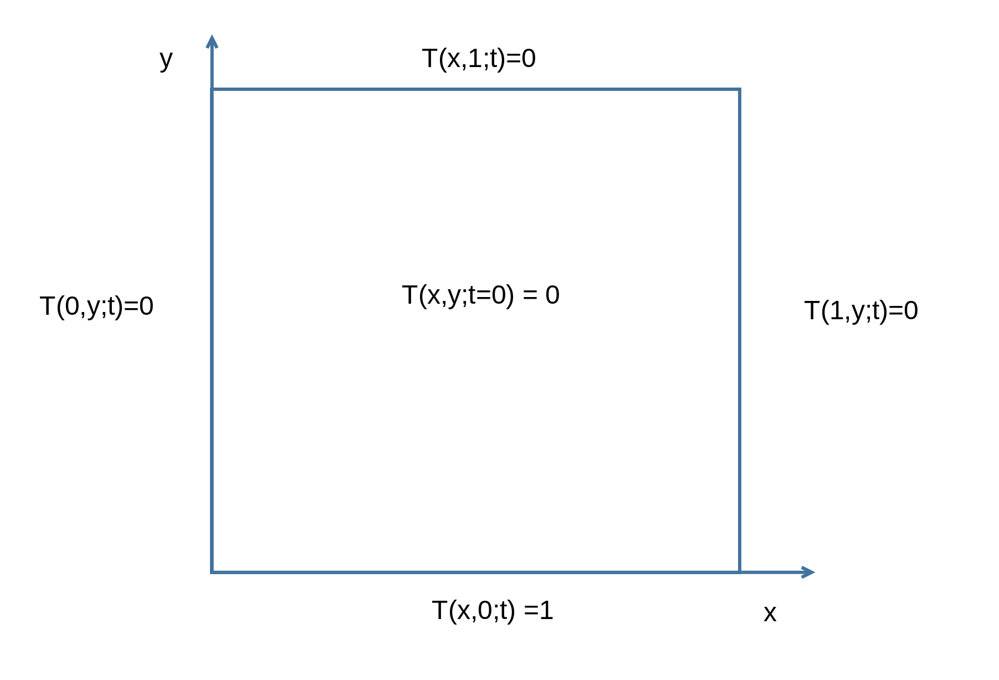
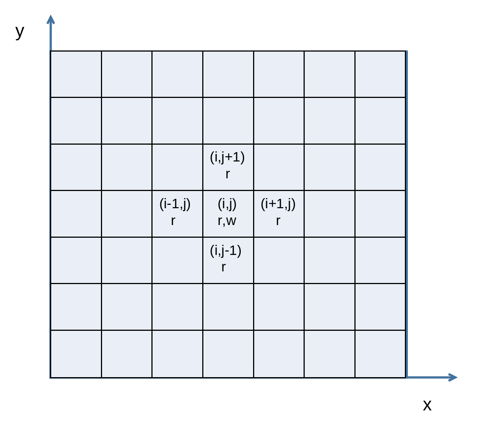
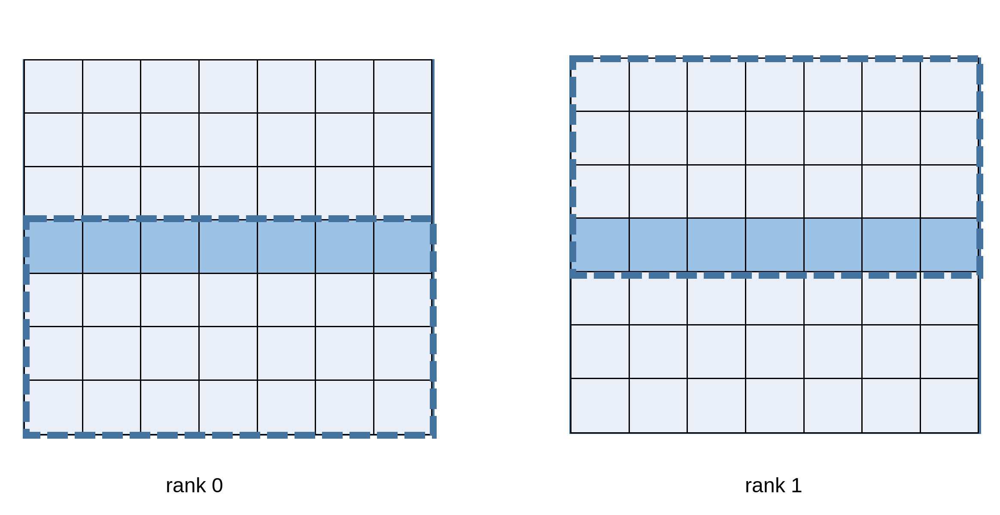
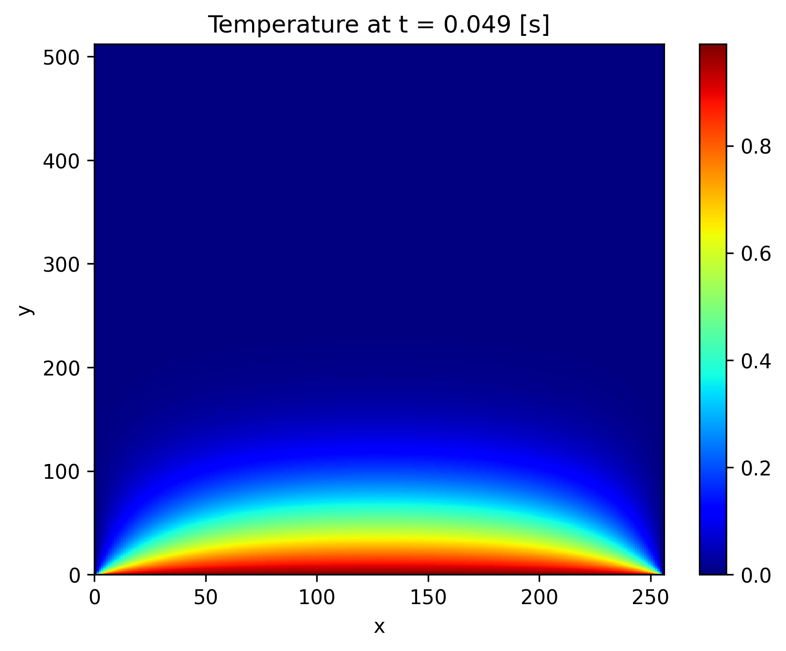

# **Laboratory 08**
## MPI & C++23 multi-thread + Jupyter notebooks

### Paolo Joseph Baioni

### 28/11/2025


---
# Outline
- recalls on spack and prerequisites
- application tour
- MPI & C++23 multi-thread
- notebook example

---
# Prerequisites

```
. /etc/profile.d/pbs.sh
qsub -I -q cpu -l select=1:ncpus=6:mpiprocs=2:host=cpu05
source /software/spack/share/spack/setup-env.sh
spack load gcc@15.2.0
spack load intel-oneapi-tbb@2022.3.0
spack load openmpi@5.0.8
which gcc
```

---
# Application: 2D heat equation
## Boundary and initial conditions
$$
U(t) \propto  \int_{\Omega} T(x,y;t)d\Omega, \quad lim_{t\rightarrow \infty}U(t)=L\in\mathbb R
$$
(steady state eq.)


---
# Application: 2D heat equation
## Grid & update
$$
T(i,j;t) \propto  \sum_{m=i-1, n=j-1}^{m=i+1, n=j+1} T(m,n;t - 1)
$$


---
# Application: 2D heat equation
## Halo exchange


---
# Application: 2D heat equation
## Expected output


---
# MPI in a multi-threaded environment
 - [https://docs.open-mpi.org/en/main/man-openmpi/man3/MPI_Init_thread.3.html](https://docs.open-mpi.org/en/main/man-openmpi/man3/MPI_Init_thread.3.html) 

---
# Parallel I/O
 - [https://docs.open-mpi.org/en/main/man-openmpi/man3/MPI_File_open.3.html](https://docs.open-mpi.org/en/main/man-openmpi/man3/MPI_File_open.3.html)
 - [https://docs.open-mpi.org/en/main/man-openmpi/man3/MPI_File_set_size.3.html](https://docs.open-mpi.org/en/main/man-openmpi/man3/MPI_File_set_size.3.htmls)
 - [https://docs.open-mpi.org/en/main/man-openmpi/man3/MPI_File_iwrite_at.3.html](https://docs.open-mpi.org/en/main/man-openmpi/man3/MPI_File_iwrite_at.3.html)

---
# C++ concurrency (11) and thread (20) support libraries
 - [https://en.cppreference.com/w/cpp/header/thread.html](https://en.cppreference.com/w/cpp/header/thread.html)
 - [https://en.cppreference.com/w/cpp/header/atomic.html](https://en.cppreference.com/w/cpp/header/atomic.html)
 - [https://en.cppreference.com/w/cpp/header/barrier.html](https://en.cppreference.com/w/cpp/header/barrier.html)

---
# Synchronisation in distributed vs shared memory
`MPI_Barrier()` and `std::barrier::arrive_and_wait()` both serve the purpose of synchronisation; however, `MPI_Barrier()` is designed for process synchronisation across multiple nodes in a distributed computing environment, whereas `std::barrier::arrive_and_wait()` is used for synchronising threads within a single process.  

While a single call to `MPI_Barrier()` is typically sufficient to synchronise all processes, in a multithreaded environment, it may be necessary to call `std::barrier::arrive_and_wait()` once (or more, depending on the specific computations) for each thread.

 ---
 # Jupyter notebooks
 Use the available environment
 ```bash
 source /software/pyplot/bin/activate
 nbterm notebook.ipynb # with GUI jupyter notebook.ipynb&
 ```
 `deactivate` when finished;
 Get your image with scp
 ```bash
 scp username@login01:/path/to/image.png .
 ```

---
# Environments
You can install your own environments, eg
 ```bash
 python -m venv ~/my_env
 source ~/my_env/bin/activate
 pip install --upgrade pip
 pip install numpy matplotlib jupyter nbterm
 
 ```
 ```bash
 git clone -c feature.manyFiles=true --depth=1 --branch \ 
 releases/v1.0 https://github.com/spack/spack.git ~/spack-v1.0
 ```


---
# References
 - [Porting a scientific application to GPU using C++ standard parallelism](https://www.researchgate.net/publication/356217103_Porting_a_scientific_application_to_GPU_using_C_standard_parallelism) and references thereinafter
 - ranges before c++23: [https://github.com/ericniebler/range-v3](https://github.com/ericniebler/range-v3)
 - c++26 proposal: [https://github.com/brycelelbach/wg21_p2300_execution](https://github.com/brycelelbach/wg21_p2300_execution), [https://en.cppreference.com/w/cpp/experimental/execution.html](https://en.cppreference.com/w/cpp/experimental/execution.html) and [https://github.com/NVIDIA/stdexec](https://github.com/NVIDIA/stdexec)
 - [https://jupyter.org/](https://jupyter.org/)
 - [https://github.com/davidbrochart/nbterm](https://github.com/davidbrochart/nbterm)
 - [https://github.com/spack/spack](https://github.com/spack/spack)
