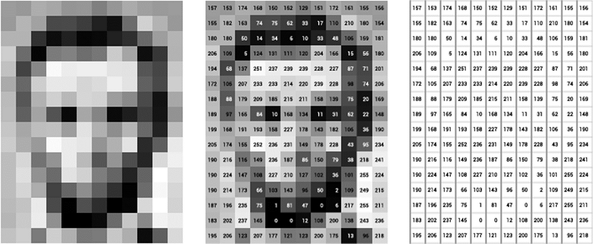
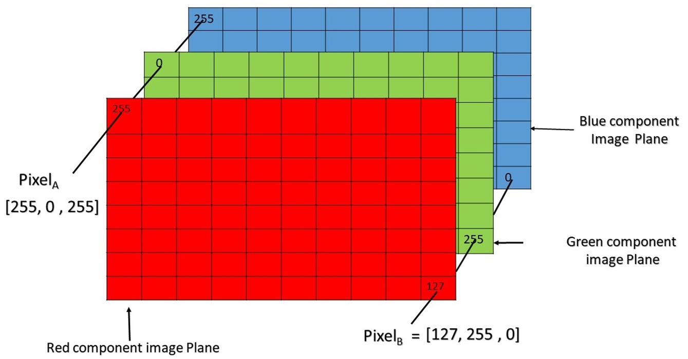

# Laboratory 01, part b

Second part of the first laboratory: the first part, on the tools of scientific computing, is in [`Lab1a_HPSCTools.md`](./Lab1a_HPSCTools.md), and the environment (container, mk modules) is set up in [`00-environment_setup/`](../00-environment_setup/).

# 1. Numerical linear algebra with Eigen

Read the documentation available at
- [Eigen user guide](https://eigen.tuxfamily.org/dox/GettingStarted.html).

Eigen is a high-level C++ library of template headers for linear algebra, matrix and vector operations, geometrical transformations, numerical solvers and related algorithms.


### 1.1 A simple example

In the following example we declare a 3-by-3 (dynamic) matrix m which is initialized using the 'Random()' method with random values between -1 and 1. The next line applies a linear mapping such that the values are between 0 and 20. 

The next line of the main function introduces a new type: 'VectorXd'. This represents a (column) vector of arbitrary size. Here, the vector is created to contain 3 coefficients which are left uninitialized. The one but last line uses the so-called comma-initializer and the final line of the program multiplies the matrix m with the vector v and outputs the result.

To access the coefficient $A_{i,j}$ of the matrix $A$, use the syntax `A(i,j)`. Similarly, for accessing the component $v_{i}$ of a vector $\boldsymbol{v}$ 
use `v(i)`

```cpp
#include <iostream>
#include <Eigen/Dense>
 
using Eigen::MatrixXd;
using Eigen::VectorXd;
 
int main()
{
  MatrixXd m = MatrixXd::Random(3,3);
  m = (m + MatrixXd::Constant(3,3,1.0)) * 10;
  std::cout << "m =" << std::endl << m << std::endl;
  VectorXd v(3);
  v << 1, 0, 0;
  std::cout << "m * v =" << std::endl << m * v << std::endl;
}
```

1. Using VS Code (or your favourite editor), open the shared folder and create a file `eigen-test1.cpp` with the content of the previous example

2. Change the current directory to the shared folder, e.g. `cd /home/ubuntu/shared-folder`.

3. In the container, make sure the Eigen library is available (try `echo ${mkEigenInc}`) or that the module is loaded by typing: `module list`.

4. Compile and run the test.
```bash
g++ -I ${mkEigenInc} eigen-test1.cpp -o test1
./test1
```

### 1.2 Block operations on matrices and vectors

Eigen provides a set of block operations designed specifically for the special case of vectors:
- Block containing the first $n$ elements: `vector.head(n)`
- Block containing the last $n$ elements: `vector.tail(n)`
- Block containing $n$ elements, starting at position $i$: `vector.segment(i,n)`

Eigen also provides special methods for blocks that are flushed against one of the corners or sides of a matrix. For instance:
- Top-left p by q block: `matrix.topLeftCorner(p,q)`
- Bottom-left p by q block: `matrix.bottomLeftCorner(p,q)`
- Top-right p by q block: `matrix.topRightCorner(p,q)`
- Bottom-right p by q block: `matrix.bottomRightCorner(p,q)`

Individual columns and rows are special cases of blocks. Eigen provides methods to easily address them (`.col()` and `.row()`). The argument is the index of the column or row to be accessed. As always in Eigen, indices start at 0.

1. Example - compile and run the following code

```cpp
#include <Eigen/Dense>
#include <iostream>
 
using namespace std;
using Eigen::VectorXd;
using Eigen::MatrixXd;
 
int main()
{
  VectorXd v(6);
  v << 1, 2, 3, 4, 5, 6;
  cout << "v.head(3) =" << endl << v.head(3) << endl << endl;
  cout << "v.tail<3>() = " << endl << v.tail<3>() << endl << endl;
  v.segment(1,4) *= 2;
  cout << "after 'v.segment(1,4) *= 2', v =" << endl << v << endl;

  MatrixXd A = MatrixXd::Random(9,9);
  MatrixXd B = A.topLeftCorner(3,6);
  VectorXd w = B*v;
  cout << "norm of B*v = " << w.norm() << endl;
}
```

2. Exercise: 

- In Eigen, construct the $100\times 100$ matrix $\tilde{A}$ be defined such that
$$ 
\tilde{A} = \begin{pmatrix}
    2 & -1 & 0 & 0&\ldots & 0  \\
    1 & 2 & -1 & 0& \ldots & 0  \\
    0 & 1 & \ddots  & \ddots &\ldots  & \vdots \\
    0 & 0 & \ddots  & \ddots  & \ddots & 0 \\
   \vdots& \vdots &  \vdots &\ddots &\ddots  & -1\\
    0 & 0  &\ldots & 0& 1   & 2
\end{pmatrix}.
$$ 

- Display the norm of $\tilde{A}$ denoted by $||\tilde{A}||$. Beware that, for a matrix, `.norm()` returns the **Frobenius** norm $\sqrt{\sum_{i,j}A_{ij}^2}$, and not the induced 2-norm. Display also $||\tilde{A}_S||$ where $\tilde{A}_S$ is the symmetric part of $\tilde{A}$, namely $2\tilde{A}_S = \tilde{A} + \tilde{A}^{T}$

- Declare a vector $\tilde{v}$ of length 50 with all the entries equal to $1$

- Compute the matrix-vector product of the $50\times50$ bottom right block of $\tilde{A}$ times the vector $\tilde{v}$ and display the result.

- Compute the scalar product (`.dot()`) between the vector $\tilde{v}$ and the vector obtained by taking the first 50 entries of the first row of $\tilde{A}$.


# 2. Image processing with Eigen

Images are stored as a collection of integers values assigned to each pixel. A greyscale image can be seen as a matrix $M$ where the coefficient $M_{ij}$ corresponds to the color of the pixel having coordinates $(i,j)$ in the picture. The admissible shades of grey range from 0 (black) to 255 (white).



An RGB picture is given by three channels, namely three integer values ranging again from 0 to 255 expressing the intensity of red, green, and blue color, respectively. 



### 2.1 Import and export images in Eigen

To load images in Eigen we will use the header only file stb_image.h available in https://github.com/nothings/stb.

To export an Eigen matrix as a `.png` file we use the header file stb_image_write.h.

Download both next to your source file with
```bash
wget https://raw.githubusercontent.com/nothings/stb/master/stb_image.h
wget https://raw.githubusercontent.com/nothings/stb/master/stb_image_write.h
```
and compile with the current directory in the include path, e.g.
```bash
g++ -I ${mkEigenInc} -I . eigen-image.cpp -o image
./image my_picture.jpg
```

In the following example we import an RGB image in Eigen, we convert it as a greyscale image, and then we export it in `.png`.

```cpp
#include <Eigen/Dense>
#include <iostream>

#define STB_IMAGE_IMPLEMENTATION
#include "stb_image.h"
#define STB_IMAGE_WRITE_IMPLEMENTATION
#include "stb_image_write.h"

using namespace Eigen;

// Function to convert RGB to grayscale
MatrixXd convertToGrayscale(const MatrixXd& red, const MatrixXd& green,
                            const MatrixXd& blue) {
  return 0.299 * red + 0.587 * green + 0.114 * blue;
}

int main(int argc, char* argv[]) {
  if (argc < 2) {
    std::cerr << "Usage: " << argv[0] << " <image_path>" << std::endl;
    return 1;
  }

  const char* input_image_path = argv[1];

  // Load the image using stb_image
  int width, height, channels;
  unsigned char* image_data = stbi_load(input_image_path, &width, &height, &channels, 3);  // Force load as RGB

  if (!image_data) {
    std::cerr << "Error: Could not load image " << input_image_path << std::endl;
    return 1;
  }

  std::cout << "Image loaded: " << width << "x" << height << " with "
            << channels << " channels in the file (forced to 3)." << std::endl;

  // Prepare Eigen matrices for each RGB channel
  MatrixXd red(height, width), green(height, width), blue(height, width);

  // Fill the matrices with image data
  for (int i = 0; i < height; ++i) {
    for (int j = 0; j < width; ++j) {
      int index = (i * width + j) * 3;  // 3 channels (RGB)
      red(i, j) = static_cast<double>(image_data[index]) / 255.0;
      green(i, j) = static_cast<double>(image_data[index + 1]) / 255.0;
      blue(i, j) = static_cast<double>(image_data[index + 2]) / 255.0;
    }
  }
  // Free memory!!!
  stbi_image_free(image_data);

  // Create a grayscale matrix
  MatrixXd gray = convertToGrayscale(red, green, blue);

  Matrix<unsigned char, Dynamic, Dynamic, RowMajor> grayscale_image(height, width);
  // Use Eigen's unaryExpr to map the grayscale values (0.0 to 1.0) to 0 to 255
  grayscale_image = gray.unaryExpr([](double val) -> unsigned char {
    return static_cast<unsigned char>(val * 255.0);
  });

  // Save the grayscale image using stb_image_write
  const std::string output_image_path = "output_grayscale.png";
  if (stbi_write_png(output_image_path.c_str(), width, height, 1,
                     grayscale_image.data(), width) == 0) {
    std::cerr << "Error: Could not save grayscale image" << std::endl;

    return 1;
  }

  std::cout << "Grayscale image saved to " << output_image_path << std::endl;

  return 0;
}
```

Note that the matrix to be exported is declared `RowMajor`, because `stbi_write_png` expects the rows to be contiguous in memory, while Eigen is column-major by default. The last argument is the stride in bytes between two consecutive rows: one byte per pixel, times `width`.

### 2.2 Exercise: Process and rotate an image

- 1. Load a greyscale image of your choice in Eigen using the following code

```cpp
#include <Eigen/Dense>
#include <iostream>
#include <cstdlib>

// from https://github.com/nothings/stb/tree/master
#define STB_IMAGE_IMPLEMENTATION
#include "stb_image.h"
#define STB_IMAGE_WRITE_IMPLEMENTATION
#include "stb_image_write.h"

using namespace Eigen;

int main(int argc, char* argv[]) {
  if (argc < 2) {
    std::cerr << "Usage: " << argv[0] << " <image_path>" << std::endl;
    return 1;
  }

  const char* input_image_path = argv[1];

  // Load the image using stb_image
  int width, height, channels;
  // for greyscale images force to load only one channel
  unsigned char* image_data = stbi_load(input_image_path, &width, &height, &channels, 1);
  if (!image_data) {
    std::cerr << "Error: Could not load image " << input_image_path << std::endl;
    return 1;
  }

  std::cout << "Image loaded: " << width << "x" << height << " with "
            << channels << " channels in the file (forced to 1)." << std::endl;
    return 0;
}

```

In Eigen modify the imported image in order to

- 2. Perform a 90° degree rotation of the image.

- 3. Make the image darker by subtracting a value 50 to each pixel

- 4. Export the resulting images using `stb_image_write.h`

### 2.3 Two hints

The rotated image is `width`-by-`height`: when you export it, remember to swap `width` and `height` in the call to `stbi_write_png`, the stride included. Mind also that `M = M.transpose()` is not allowed in Eigen, since the matrix would be written while it is being read: use `M.transposeInPlace()`, or assign the result to a different matrix.

When you make the image darker, beware that the pixels are stored as `unsigned char`: the operation `pixel - 50` wraps around for the dark pixels, so that 20 becomes 226 and the image gets brighter spots. Work on a matrix of `double` and clamp the result before casting it back, e.g.
```cpp
MatrixXd darker = (gray.array() - 50.0).cwiseMax(0.0).matrix();
```
(or subtract `50.0/255.0`, if you normalised the values to $[0,1]$ as in the previous example). The same care is needed for the upper bound, 255, whenever you brighten an image.
