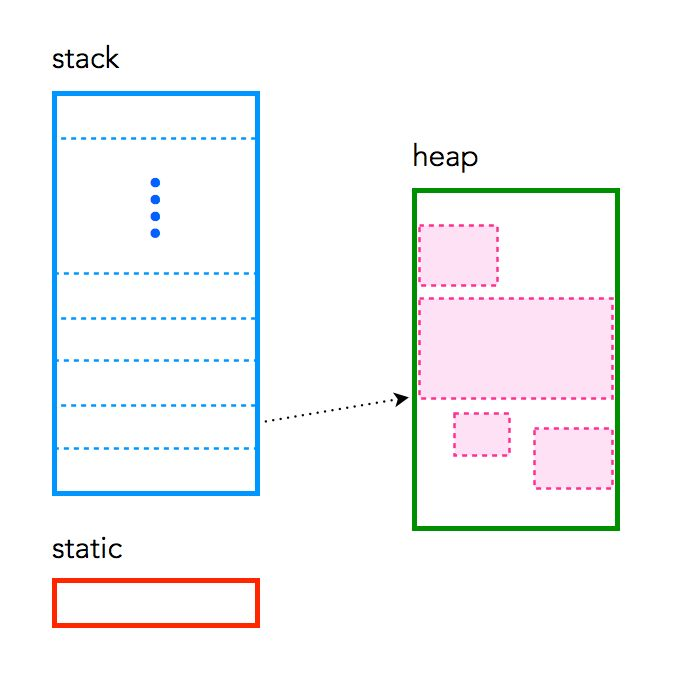
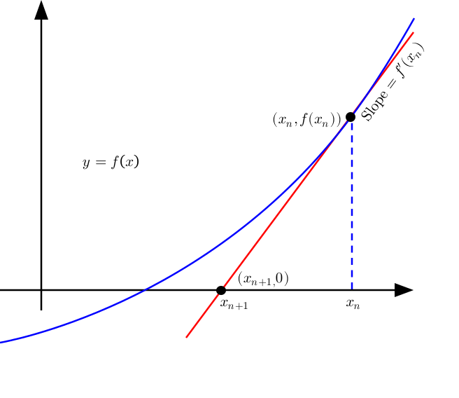

# Laboratory 02 — Smart pointers and callable objects

### 02/10/2026

This lab puts into practice the last two lectures of the introduction to C++: *Smart pointers* and *Callable objects: functions, functors, and lambdas*. Keep the slides of the lectures at hand: here the theory is only recalled in a few lines at the start of each section, and most of the time is spent writing and running code.

Each exercise has an `assignment`, to be completed, and a `solution`. The ✅ **Checkpoint** at the end of each section shows the output you should get. Whatever you do not finish in class is listed in the [Homework](#homework).

## Outline

- [0. Setup](#0-setup)
- **Part 1 — Smart pointers**
  - [1. Memory in C++: stack, heap, static](#1-memory-in-c-stack-heap-static)
  - [2. Break it: raw pointers and AddressSanitizer](#2-break-it-raw-pointers-and-addresssanitizer)
  - [3. Predict it: the lifetime of a `unique_ptr`](#3-predict-it-the-lifetime-of-a-unique_ptr)
  - [4. Exercise: who owns the datasets?](#4-exercise-who-owns-the-datasets)
- **Part 2 — Callable objects**
  - [5. The zoo of callables](#5-the-zoo-of-callables)
  - [6. How much does a callable cost?](#6-how-much-does-a-callable-cost)
  - [7. Exercise: Newton's method](#7-exercise-newtons-method)
- [Homework](#homework)

---

## 0. Setup

Update the repository and move to the directory of this lab, inside the container:
```bash
cd ~/shared-folder/AMSC-Labs
git pull
cd Labs/2026-27/02-smart_pointers-callables
ls smart_pointers callables
```
We only need the compiler: every single-file example has the command to compile it written at the top, and the exercises have a `Makefile` (`make run`), like the one of [Lab 1](../01-scientific_computing_tools/Lab1a_HPSCTools.md#32-gnu-make).

---

# Part 1 — Smart pointers

## 1. Memory in C++: stack, heap, static

Every variable lives somewhere in memory, and *where* it lives decides two things: **how long it lives** and **who frees it**. Smart pointers exist because of these two questions, so let us start from a concrete example:

```cpp
int counter = 0;                    // static: exists for the whole run of the program

void f() {
  int x = 1;                        // stack: created here...
  double *p = new double[1000];     // p is on the stack, the 1000 doubles are on the heap
  std::vector<double> v(1000);      // v is on the stack, its 1000 doubles are on the heap
  // ...
}                                   // ...x, p and v are destroyed here, automatically.
                                    // v's destructor frees its 1000 doubles;
                                    // p is just an address: its 1000 doubles are LEAKED
```

|  | **static** | **stack** | **heap** (or *free store*) |
|---|---|---|---|
| What lives there | global variables, variables declared `static` | local variables, function arguments | what you create with `new` |
| Created | when the program starts | when the declaration is reached | at `new` |
| Destroyed | when the program ends | at the `}` that closes its scope, **automatically** | at `delete`, **only if you call it** |
| Size | fixed at compile time | small, typically 8 MB (`ulimit -s`) | as large as the RAM |

**The stack.** When a function is called, all its local variables are placed together in a block called a *frame*, on top of the frame of the caller. When the function returns, its frame is removed:
```
 main calls f, f calls g:            g returns:

 ┌───────────────┐ <- top
 │ frame of g    │
 ├───────────────┤                   ┌───────────────┐ <- top
 │ frame of f    │                   │ frame of f    │
 ├───────────────┤                   ├───────────────┤
 │ frame of main │                   │ frame of main │
 └───────────────┘                   └───────────────┘
```
Freeing a frame is just moving the top back, so the stack is very fast and you never have to free anything by hand. The price: a local variable dies with its function (never return a pointer or a reference to it), and the stack is small: a large local array, or a recursion that is too deep, causes a **stack overflow**.

**The heap.** It is a large region where you *ask* for memory (`new`) and you must *give it back* (`delete`). Nobody does it for you: forgetting it is a **memory leak**.

**The link between the two.** Look again at `p` and `v` in the example: both are small objects on the stack that contain the *address* of a large block on the heap. This is the arrow in the picture:



When `f` returns, both `p` and `v` are destroyed together with the frame. The difference is that `std::vector` has a **destructor** that calls `delete` on its block, while a raw pointer has no destructor, so its block stays allocated and is unreachable. This is the idea to remember for the whole lab:

> An object on the stack that *owns* a block on the heap and frees it in its destructor.

`std::vector`, `std::map`, `std::string` work like this, and smart pointers (`std::unique_ptr`, `std::shared_ptr`) are exactly this: a pointer with a destructor that calls `delete`. This is why you should **always prefer** them to `new`/`delete`.

### Look at the addresses

[`smart_pointers/01-memory/memory.cpp`](smart_pointers/01-memory/memory.cpp) prints the address of variables living in the three regions. Read it, then run it:
```bash
cd smart_pointers/01-memory
g++ -Wall -std=c++20 memory.cpp -o memory
./memory
```
Answer looking at the output (the exact numbers depend on the machine; look at the leading digits):
1. Can you see three groups of addresses? Which group is the static variable `Counter::count` in, and which one the local variables of `main`?
2. `z` is a local variable of `a_function`, so its frame is *on top* of the frame of `main`. Is the address of `z` larger or smaller than that of `y`? In which direction does the stack grow?
3. `v` in `a_function` and `v` in `main` are two different vectors, but their data may have the **same** address. How is this possible?
4. The program prints `pt.get()`, i.e. the address of the `Counter` on the heap. Where is the variable `pt` itself?
5. Why does `v.data()` change after the `push_back`s? What would happen to a pointer `int *first = &v[0]` taken before them?

✅ **Checkpoint.** In the container (Linux) you get something like
```
Static memory: 0x5568cd22a1d8
Stack memory (y): 0x7ffd4d7ddbdc
Stack memory (a): 0x7ffd4d7ddc1c
Stack memory (c): 0x7ffd4d7ddbdb
Heap memory (v in a_function): 0x5568e4cb3730
Stack memory (z): 0x7ffd4d7ddb84
Heap memory (v after init): 0x5568e4cb3730
Heap memory (pt): 0x5568e4cb3760
Heap memory (v after push_back): 0x7f3efa8de010
```

<details>
<summary>Answers</summary>

1. Stack addresses start with `0x7ff...`; static and heap ones with `0x55...`, with the static one lower.
2. `z` (`...b84`) is smaller than `y` (`...bdc`): on most architectures the stack grows **downwards**, towards lower addresses.
3. When `a_function` returns, its `v` is destroyed and its destructor frees the block. The next allocation of the same size reuses that free block.
4. On the stack, like any local variable: it is a small object (8 bytes) holding the address of the `Counter`. It is `p` of the example above, but with a destructor.
5. When the vector is full, `push_back` allocates a larger block, copies the elements there and frees the old block. A pointer to the old elements is now **dangling**: it points to freed memory. (The new address looks different because large blocks are requested directly to the operating system, in a different area; it is still dynamic memory.) The next section shows why dangling pointers are a problem.

</details>

---

## 2. Break it: raw pointers and AddressSanitizer

When a raw pointer *owns* an object, `delete` must be called **exactly once**, on every path, exceptions included. Otherwise you get a **leak** (never deleted), a **double delete** (deleted twice), or a **dangling pointer** (used after being deleted).

[`smart_pointers/02-raw_pointers/raw_pointers.cpp`](smart_pointers/02-raw_pointers/raw_pointers.cpp) contains one of each. Read it, then compile and run the three cases:
```bash
cd ../02-raw_pointers
g++ -Wall -std=c++20 raw_pointers.cpp -o raw_pointers
./raw_pointers leak ; ./raw_pointers double ; ./raw_pointers dangling
```
Does the program crash? Does it print something wrong? Often it *seems* to work: undefined behaviour does not mean "crash".

Now let the compiler instrument every memory access, with **AddressSanitizer**:
```bash
g++ -Wall -std=c++20 -g -fsanitize=address raw_pointers.cpp -o raw_pointers_asan
./raw_pointers_asan leak ; ./raw_pointers_asan double ; ./raw_pointers_asan dangling
```

✅ **Checkpoint.** You get three reports, each pointing to the line of the bug and to the line of the allocation:
```
==1234==ERROR: LeakSanitizer: detected memory leaks
==1234==ERROR: AddressSanitizer: attempting double-free on 0x607000000090 ...
==1234==ERROR: AddressSanitizer: heap-use-after-free on address 0x6070000000a0 ...
```
(Leak detection works on Linux, i.e. in the container, but not on macOS.)

From now on, compile with `-g -fsanitize=address` whenever you develop. It makes the program about 2x slower, so do not use it for production runs or timings.

---

## 3. Predict it: the lifetime of a `unique_ptr`

`std::unique_ptr<T>` is the **only owner** of its object: it deletes the object when it is destroyed, reset or reassigned. It **cannot be copied**, only **moved**, and it costs nothing more than a raw pointer. Create it with `std::make_unique<T>(args...)`.

[`smart_pointers/03-unique_ptr/unique_ptr.cpp`](smart_pointers/03-unique_ptr/unique_ptr.cpp) uses a class `Tracer` that prints `+` when an object is created and `-` when it is destroyed.

1. **Before running it**, read `main` and write on paper the sequence of `+` and `-` lines of points 3 (`reset`) and 6 (`vector`).
2. Compile, run, and compare with your prediction:
   ```bash
   cd ../03-unique_ptr
   g++ -Wall -std=c++20 -g -fsanitize=address unique_ptr.cpp -o unique_ptr
   ./unique_ptr
   ```
3. Break it on purpose, one change at a time:
   - uncomment `auto c = b;`: which function does the error say is *deleted*?
   - in point 6, write `for (auto p : v)` instead of `for (auto const &p : v)`: why does it not compile?
   - remove `delete raw;` in point 5: what does AddressSanitizer say?

✅ **Checkpoint.**
```
3. reset and assignment
  + Tracer(c2)
  - ~Tracer(b)
  + Tracer(c3)
  - ~Tracer(c2)
  - ~Tracer(c3)
...
7. exceptions
  + Tracer(exception-safe)
  - ~Tracer(exception-safe)
  caught: something went wrong
```
Point 7 is the leak of section 2, fixed: the destructor runs even when an exception is thrown.

The type of a function parameter says what the function does with the ownership. Keep this table in mind for the next exercise:

| Signature | Meaning |
|---|---|
| `void f(T const &t)` / `void f(T *t)` | `f` only **uses** the object (the pointer may be `nullptr`) |
| `void f(std::unique_ptr<T> p)` | `f` **takes ownership**: the caller must `std::move` |
| `std::unique_ptr<T> f()` | `f` **creates** the object and hands it to the caller |

---

## 4. Exercise: who owns the datasets?

A function that creates an object and hands it to the caller is the typical *source* of a `unique_ptr`: the type of the returned value says, without any comment, that the caller is now the owner (lecture on smart pointers, slides 4–6).

In [`smart_pointers/04-datasets/assignment`](smart_pointers/04-datasets/assignment) you find
- `datasets.hpp`, `datasets.cpp`: the aggregate `struct Dataset { std::string name; std::vector<double> values; };`, the function `read_dataset`, which reads a line such as `pressure 1.2 1.5 1.1` and creates a new `Dataset`, and the function `mean`;
- `main.cpp`: reads [`datasets.txt`](smart_pointers/04-datasets/assignment/datasets.txt) line by line, stores the datasets in a vector, copies those with mean > 10 into a second vector, and deletes everything at the end.

The code compiles and runs, and it prints the right numbers. Now compile it with AddressSanitizer: uncomment the two `-fsanitize=address` lines in the `Makefile`, then
```bash
cd ../04-datasets/assignment
make distclean && make run
```
What does LeakSanitizer report? Look at the two `return nullptr;` in `read_dataset`, and at the two vectors in `main`: which one owns the datasets?

**Your tasks**:
1. Make the ownership explicit: `read_dataset` returns `std::unique_ptr<Dataset>`, built with `std::make_unique`, and `main` stores the datasets in a `std::vector<std::unique_ptr<Dataset>>`. When you are done, no `new` and no `delete` are left in the code, and the leak is gone. Why?
2. Write `print_all(title, datasets)`, which prints name, number of values and mean of each dataset. How do you pass the vector?
3. **Transfer** the datasets with mean > 10 from `all` to a second vector `large`, with `std::move`. What is left in `all` after the move? Remove the empty pointers from `all` with `std::erase_if` and a lambda.
4. Find the dataset with the largest mean in `large` with `std::max_element` and a lambda that compares the means (you will see more lambdas in Part 2). Keep a **non-owning** `Dataset const *` to it.

✅ **Checkpoint.**
```
Skipping invalid line: empty
Skipping invalid line: velocity        0.5 0.7 abc
all:
  pressure, 4 values, mean 1.275
  temperature, 3 values, mean 20.4333
  density, 4 values, mean 999.75
  strain, 2 values, mean 0.0015
large (mean > 10):
  temperature, 3 values, mean 20.4333
  density, 4 values, mean 999.75
remaining:
  pressure, 4 values, mean 1.275
  strain, 2 values, mean 0.0015
Largest mean: density
```
There is no report from the sanitizer: nothing leaks, and each dataset is destroyed exactly once, by the vector that owns it.

Solution: [`smart_pointers/04-datasets/solution`](smart_pointers/04-datasets/solution).

---

# Part 2 — Callable objects

## 5. The zoo of callables

A **callable** is anything that can be called as `f(args...)`: a function, a function pointer, a **functor** (a class with `operator()`), a **lambda**, or a `std::function`. A lambda is just a functor written by the compiler for you: the captured variables become its data members, and its body becomes `operator() const`.

[`callables/01-callables/callables.cpp`](callables/01-callables/callables.cpp) writes $f(x) = ax^2 - 2$ in every form. Compile and run it:
```bash
cd ../../../callables/01-callables
g++ -Wall -std=c++20 callables.cpp -o callables
./callables
```
and answer:
1. After `a = 1.`, `lambda` still prints 10, while `lambda_ref` follows `a`. Why? When does capturing by reference become a bug? (Think of a function that *returns* a lambda.)
2. Uncomment `evaluate_at_two_ptr(lambda);`. Why does a lambda *without* captures convert to a function pointer, while one *with* captures does not?
3. `l1` and `l2` have identical text but different types. How many instantiations of `template <typename F> void g(F)` do `g(l1); g(l2);` generate?

Captures at a glance: `[x]` by value, `[&x]` by reference, `[=]`/`[&]` everything that is used, `[v = std::move(w)]` a new member initialised with an expression. The `operator()` of a lambda is `const`; `mutable` lets it modify what it captured by value.

---

## 6. How much does a callable cost?

[`callables/02-benchmark/benchmark.cpp`](callables/02-benchmark/benchmark.cpp) integrates $x^2$ on $[0,1]$ with $5\cdot10^7$ points. It passes the integrand in three ways: as a **template** parameter, as a **function pointer**, and as a **`std::function`**. Run it without and with optimisation:
```bash
cd ../02-benchmark
g++ -std=c++20 -O0 benchmark.cpp -o b0 && ./b0
g++ -std=c++20 -O3 benchmark.cpp -o b3 && ./b3
```
✅ **Checkpoint.** The absolute times depend on your machine, but the pattern should look like this (ms, measured on a laptop):

| | `-O0` | `-O3` |
|---|---|---|
| template + lambda | 172 | **43** |
| template + function | 173 | **43** |
| function pointer | 173 | 46 |
| `std::function` | **339** | 59 |

Discuss with your neighbour:
1. Why is `std::function` twice as slow as the others at `-O0`?
2. At `-O3`, which version is the fastest, and why?

<details>
<summary>Answers</summary>

1. At `-O0` the compiler does not optimise anything: every call is a real function call. A function pointer costs one call per point; `std::function` hides the callable behind a few layers of wrapper functions, and each layer is one more call.
2. The two template versions. With a template parameter the compiler generates a version of `midpoint_template` for that specific callable, so it knows exactly which function is called and can copy its body (`x * x`) inside the loop (*inlining*): no call is left at all. With a function pointer or a `std::function` the function to call is chosen at run time, so the compiler cannot inline it and every iteration still pays for a call. At `-O3` the layers of `std::function` are optimised away, and what is left is an indirect call, like with a function pointer. Here the gain of the template is small because the integrand is very cheap; once the body is inlined, though, the compiler can optimise the loop further, which is impossible through a pointer.

</details>

**Take-away:** take the callable as a template parameter in the inner loops that must be fast. Use `std::function` when you need to *store* callables of different types, e.g. as a class member.

---

## 7. Exercise: Newton's method

Newton's method finds a root of $f$ by iterating

$$x_{k+1}=x_{k}-\frac{f(x_{k})}{f'(x_{k})},$$



and stops when $|f(x_k)|<$ `rtol`, or $|x_k-x_{k-1}|<$ `stol`, or after `max_iter` iterations (in which case it has *not* converged). Close to a simple root, the convergence is quadratic.

In [`callables/03-newton/assignment`](callables/03-newton/assignment), `newton.hpp` contains `NewtonOptions`, which collects the parameters (with defaults), `NewtonResult`, the output (root, iterations, residual, whether it converged, and the history of the iterates), and the function `newton` to be completed.
```bash
cd ../03-newton/assignment
make run
```
**Your tasks**:
1. Implement the body of `newton` in `newton.hpp`. What do you do if $f'(x_k) = 0$?
2. `newton` takes `f` and `df` as function pointers. Make it a function template, so that it also accepts functors and lambdas with captures. Why must its definition stay in the header?
3. Case 3 in `main.cpp`: for $a = 2, 3, 5$ compute $\sqrt a$ as the root of $x^2 - a$, with a lambda that captures `a`.
4. Write a function template `centred_difference(f, h = 1e-6)` that **returns a lambda** approximating $f'(x) \approx \frac{f(x+h)-f(x-h)}{2h}$, and use it in case 4. Should `f` be captured by value or by reference? Think about who keeps `f` alive when the returned lambda is called.

✅ **Checkpoint.**
```
functions                    root = 1.4142135623731, iterations = 5, residual = 2.73e-16
lambda, sqrt(2)              root = 1.4142135623731, iterations = 5, residual = 2.73e-16
lambda, sqrt(3)              root = 1.73205080756888, iterations = 5, residual = 3.48e-16
lambda, sqrt(5)              root = 2.23606797749998, iterations = 5, residual = 8.43e-13
finite differences           root = 1.4142135623731, iterations = 5, residual = 2.73e-16
```
Solution: [`callables/03-newton/solution`](callables/03-newton/solution).

---

## Homework

What is left from the lab, plus some extra exercises:
- **Lambdas and the standard algorithms**: the [exercise below](#exercise-lambdas-and-the-standard-algorithms).
- **Section 7**, the cases marked *at home* in `main.cpp`:
  - case 2: implement `Polynomial::derivative()` and find the root of $x^3 - 2x - 5$ starting from $x_0=2$;
  - case 5: print $|x_k - \sqrt2|$ for each iterate. Do the correct digits double at each step?
  - case 6: count the evaluations of $f$ with finite differences and `rtol = 1e-8` (expected: 4 iterations, 13 evaluations). Why does a counter captured by value in a `mutable` lambda **not** compile? (`newton` takes `f` as `F const&`.)
- **Other methods.** Implement the secant method, which replaces $f'(x_k)$ with $\frac{f(x_k)-f(x_{k-1})}{x_k-x_{k-1}}$, and the bisection method, which needs an interval $[a,b]$ with $f(a)f(b)<0$, as function templates returning a `NewtonResult`, and compare the number of iterations of the three methods on the same function.
- **Advanced.** Use the recursive lambda `numDeriv<N>` from the lecture to implement Halley's method, $x_{k+1} = x_k - \frac{2ff'}{2f'^2 - ff''}$, and check that it converges cubically.

### Exercise: lambdas and the standard algorithms

The algorithms of `<algorithm>` and `<numeric>` implement a loop once, correctly; you give them *what* to do as a lambda:

| Algorithm | Callable |
|---|---|
| `std::count_if(b, e, p)`, `std::find_if(b, e, p)` | `p(x) -> bool` |
| `std::sort(b, e, cmp)` | `cmp(a, b) -> bool`, must behave like `<` |
| `std::transform(b, e, out, f)` | `f(x)` is written to `out` |
| `std::accumulate(b, e, init)` | sums the elements, starting from `init` |
| `std::erase_if(v, p)` (C++20) | removes the elements for which `p(x)` is true |

Complete the TODOs of [`callables/04-stl_lambdas/assignment.cpp`](callables/04-stl_lambdas/assignment.cpp), with one algorithm and one lambda each, and no loops:
```bash
cd callables/04-stl_lambdas
g++ -Wall -std=c++20 assignment.cpp -o assignment && ./assignment
```
In point 2 the comparison must be **strict** (`>`, never `>=`): otherwise `std::sort` has undefined behaviour.

✅ **Checkpoint.**
```
values: 0.5 -1.2 2.3 -0.4 1.8 -2.1 0.9 0.1 -0.7 1.5
5 values in [-1, 1]
sorted by |x|: 2.3 -2.1 1.8 1.5 -1.2 0.9 -0.7 0.5 -0.4 0.1
mean = 0.27
minus the mean: 2.03 -2.37 1.53 1.23 -1.47 0.63 -0.97 0.23 -0.67 -0.17
non negative: 2.03 1.53 1.23 0.63 0.23
first particle with mass > 4: id 5, x = 1.1
```
Solution: [`solution.cpp`](callables/04-stl_lambdas/solution.cpp).

**Further reading** in [`AMSC-CodeExamples/Examples/src`](https://github.com/HPC-Courses/AMSC-CodeExamples/tree/AMSC/Examples/src): [`SmartPointers`](https://github.com/HPC-Courses/AMSC-CodeExamples/tree/AMSC/Examples/src/SmartPointers), [`Functors`](https://github.com/HPC-Courses/AMSC-CodeExamples/tree/AMSC/Examples/src/Functors), [`LambdaExpr`](https://github.com/HPC-Courses/AMSC-CodeExamples/tree/AMSC/Examples/src/LambdaExpr), [`Derivatives`](https://github.com/HPC-Courses/AMSC-CodeExamples/tree/AMSC/Examples/src/Derivatives).
